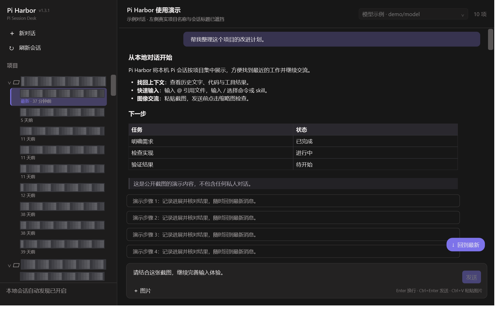
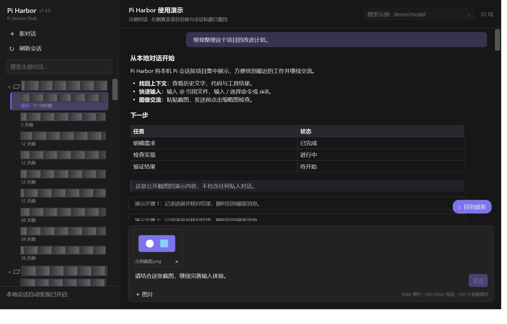
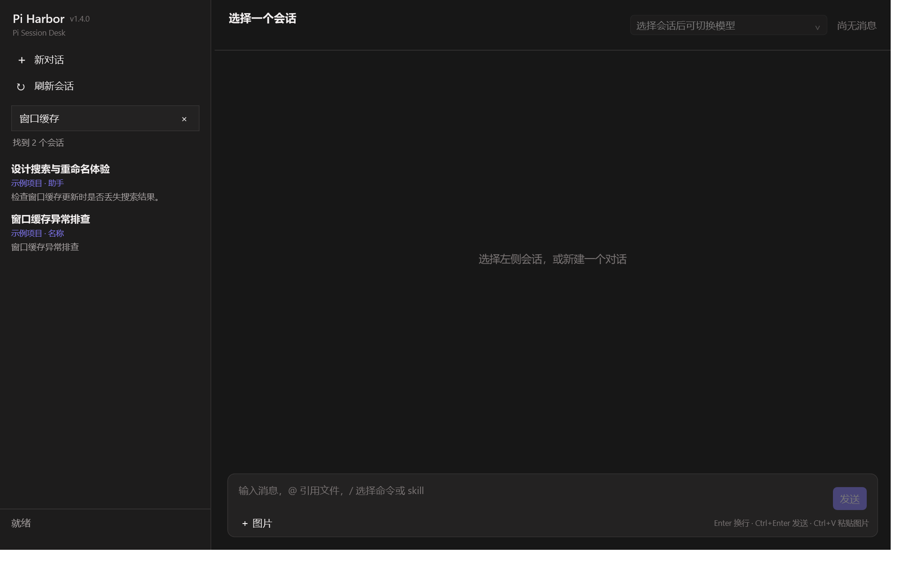

# Pi Harbor

**Pi Session Desk — 本地 Pi 会话的 Windows 桌面工作台。**

[](https://github.com/BlazarLin/Pi-Harbor/actions/workflows/ci.yml)
[](LICENSE)

按项目浏览本机 Pi 会话，找回最近的交流，继续文字与图片对话。无需启动本地 Web 服务。

**源码版本：1.5.0 · 已验证 Pi：0.84.3 · Windows 10/11 x64**

## 软件截图

以下为实际 WPF 应用截图。真实项目名称与会话标题在截图前使用不透明马赛克遮挡，右侧是演示内容；活动时间、布局和交互样式保持真实。





全局搜索示例（仅使用独立测试会话）：



## 下载与安装

从 [GitHub Releases](https://github.com/BlazarLin/Pi-Harbor/releases) 下载安装包或便携版；也可按下文从源码构建。

| 文件 | 使用方式 |
| --- | --- |
| `Pi-Harbor-Setup-win-x64.exe` | 当前用户安装、开始菜单入口、可选桌面快捷方式，支持升级和卸载 |
| `Pi-Harbor-win-x64.zip` | 便携版，解压后运行 `Pi-Harbor.exe` |
| `SHA256SUMS.txt` | 对照 `Get-FileHash 文件名 -Algorithm SHA256` 验证下载 |

两种包均携带 .NET 运行库。GitHub 的 **Source code (zip)** 是源码包，不是可执行版。当前安装器未签名，Windows 可能显示发布者未知提示。

## 先准备 Pi

Pi Harbor 依赖用户安装的 [Pi coding agent](https://github.com/earendil-works/pi/tree/main/packages/coding-agent)，不捆绑 Pi、Node.js 或模型认证信息。

兼容性验证基线为 **`@earendil-works/pi-coding-agent` 0.84.3**，不保证所有旧版本或未来版本都兼容。先准备符合 Pi 要求的 Node.js，再安装基线版本：

```powershell
npm install -g @earendil-works/pi-coding-agent@0.84.3
pi --version
pi
```

在 Pi 中配置模型与认证，确认终端可以交流，再运行 Pi Harbor。应用不直接读取或保存 API Key；Pi 子进程会使用自己的配置和认证。

## 功能

- 自动发现默认目录 `%USERPROFILE%\.pi\agent\sessions` 中的会话，按真实项目 `cwd` 分组。
- 按最近活动排序，显示分钟／小时／天的时间差，标记全局最新会话；每分钟刷新，悬停显示完整日期时间。
- 全局搜索会话名称、项目路径和全部已保存的消息文字，显示匹配来源及正文片段。
- 自定义重命名、跨重启保留名称、恢复默认；列表、当前标题及搜索结果同步更新。
- 加载已有对话、新建项目对话、在空闲时切换 Pi 已配置的模型。
- 流式显示文字、折叠思考与工具结果，显示每轮耗时与 Token 用量。
- 可选择复制的 Markdown 正文，支持代码块、表格、列表、引用等格式。
- `@` 引用文件，`/` 选择 Pi 命令、模板或 skill。
- 粘贴图片、添加图片文件、检查缩略图、点击放大、移除附件和纯图片消息。
- 大会话轻量历史读取与虚拟化显示；上滚保持阅读位置，紫色圆角“回到最新”恢复跟随。
- 本次运行内按会话保留草稿；发送未确认时保留输入，重新连接并核对历史后再发送。

## 操作速查

| 操作 | 方法 |
| --- | --- |
| 新对话 | 点击“新对话”并选择项目文件夹 |
| 继续会话 | 点击左侧会话 |
| 全局搜索 | 左侧搜索框或 `Ctrl+Shift+F`，输入关键词；`Enter` 立即搜索，`Esc` 清空 |
| 重命名 | 右键会话 → 重命名，或在会话列表中按 `F2`；支持恢复默认 |
| 发送／换行 | `Ctrl+Enter` 发送，`Enter` 换行 |
| 引用文件 | 输入 `@关键词`，插入相对路径，供模型按需读取 |
| 命令与 skill | 在消息开头输入 `/` 筛选当前 Pi 返回的项目 |
| 选择补全 | `↑` / `↓`，`Tab` / `Enter` 确认，`Esc` 关闭 |
| 图片 | `Ctrl+V` 粘贴截图或复制的图片文件，或点击“＋ 图片” |
| 预览／移除 | 点击缩略图放大，`Esc` 关闭；点击 `×` 移除 |
| 停止生成 | 点击“停止” |
| 打开项目目录 | 右键项目名称 → 在文件资源管理器中打开 |

同一时刻只生成一个会话。生成期间可准备后续输入，切换会话前需等待完成或停止。

### 搜索与自定义名称

搜索按不区分大小写的连续文字匹配，覆盖所有已保存的历史分支，以及用户、助手、思考和工具输出的文本。图片 Base64、协议字段和工具调用参数不参与搜索。最多显示最近的 100 个匹配会话，超过时提示缩小关键词；损坏记录或无法读取的文件也会提示。点击结果打开会话当前分支，暂不跳转到原始命中位置。

自定义名称只用于本机 Pi Harbor，保存在 `%LOCALAPPDATA%\Pi Harbor\session-names`，不会同步为 Pi 终端名称。最长 120 个字符，可恢复默认。名称按原会话文件的绝对路径关联；移动或更换会话文件路径后需重新设置。重命名不改变对话的最近交流时间。

### 终端新建的 Pi 对话

应用监听默认会话目录，文件事件合并到约 300 ms 后刷新；约 **5 秒一次的元数据复查** 补偿漏事件、根目录稍后创建和监听中断。未变化的文件使用索引缓存，刷新保留项目折叠与当前会话状态。

**Pi 0.84.3 的空会话通常尚未落盘；首条助手消息保存后才可被发现。** `pi --no-session` 不保存会话，自定义 `--session-dir` 也不在默认扫描范围。发现会话不等于实时镜像外部终端正在生成的正文；避免两个客户端同时写同一会话文件。

## 当前边界

- 草稿关闭应用后不会恢复；持久化草稿属于下一阶段。
- 本次发送的图片可以预览；重新打开历史时显示附件提示，暂不加载历史原图。
- 每条最多 4 张图片，单张转 PNG 后不超过 10 MB、4000 万像素；GIF/TIFF 使用第一帧。图片理解能力由模型决定。
- 文件搜索跳过 `.git`、依赖和常见构建目录、符号链接；最多 40 个结果、30000 个条目或 1.5 秒，尚不完整解析 `.gitignore`。其他文件可手动输入路径。
- `/settings` 等 Pi 终端专用命令不进入菜单；依赖交互表单的扩展尚未完整适配。
- 尚无会话删除、导出、分支树编辑和多会话并行生成。

## 从源码构建

需要 Windows x64 和 .NET 10 SDK。应用源码没有第三方 NuGet 包依赖；自包含发布需恢复官方运行库包。自动测试使用伪 RPC，不需要 Pi 或模型密钥。

```powershell
git clone https://github.com/BlazarLin/Pi-Harbor.git
cd Pi-Harbor
dotnet build Pi-Harbor.sln -c Debug
powershell -NoProfile -File scripts/run-tests.ps1
powershell -NoProfile -File scripts/build-release.ps1
```

输出位于 `artifacts/Pi-Harbor-win-x64/` 和 `artifacts/Pi-Harbor-win-x64.zip`。

安装 [Inno Setup 6](https://jrsoftware.org/isdl.php) 后，同时生成安装 EXE：

```powershell
powershell -NoProfile -File scripts/build-release.ps1 -IncludeInstaller
```

### GitHub Release 配置

已提供 Windows CI 和版本标签发布工作流。推送与项目版本一致的标签（当前源码为 `v1.5.0`）后，自动测试、打包并创建带 **安装 EXE、便携 ZIP、SHA256SUMS** 的 Release 草稿；维护者检查后点击 Publish release，用户即可下载。

详细设置、标签命令、手动构建、权限与签名说明见 [GitHub 发布指南](docs/GITHUB_RELEASE.md)。

## 界面验收与截图

```powershell
# 离线 Pi 输入区验收，不保存会话、不发送模型请求
artifacts\Pi-Harbor-win-x64\Pi-Harbor.exe --qa-composer-capture-dir artifacts\qa\composer

# 可公开截图：真实列表渲染前遮挡，仅用演示正文，不启动 Pi
artifacts\Pi-Harbor-win-x64\Pi-Harbor.exe --capture-public-docs artifacts\qa\public

# 搜索与重命名实机 UI 验收：使用新目录，自动创建独立测试会话，不启动 Pi
artifacts\Pi-Harbor-win-x64\Pi-Harbor.exe --qa-search-capture-dir artifacts\qa\search

# 大会话滚动验收
artifacts\Pi-Harbor-win-x64\Pi-Harbor.exe --capture-session <session.jsonl> --qa-scroll-capture-dir artifacts\qa\scroll
```

原始 QA 默认保存在 Git 忽略的 `artifacts/`。公开前检查实际图像，不要上传未经脱敏的会话截图。

## 架构与排查

- `PIHarness.Core`：JSONL 解析、会话目录与 Pi RPC 子进程。
- `PIHarness.App`：WPF、聊天状态、Markdown、输入与滚动交互。
- `PIHarness.Tests`：无第三方测试框架的验收程序。

应用启动 `pi --mode rpc --approve`，通过 stdin/stdout UTF-8 JSONL 通信，不启动本地网络服务。

| 问题 | 排查 |
| --- | --- |
| 未找到 pi.cmd | 确认终端 `pi --version` 成功，npm 全局目录在 `PATH` 中 |
| 终端会话未出现 | 确认 JSONL 已写入默认目录，等约 5 秒或点击刷新；空会话和其他目录不在发现范围 |
| 会话打不开 | 确认项目 `cwd` 存在；错误后用“重新连接”恢复草稿与上下文 |
| 模型／认证／限额错误 | 在 Pi 中修复配置，核对历史后再发送 |
| 图片失败 | 确认模型支持图像，缩小图片或减少附件 |

## 贡献、许可与路线图

欢迎 [报告问题](https://github.com/BlazarLin/Pi-Harbor/issues) 或提交 PR。参阅 [贡献指南](CONTRIBUTING.md)、[安全报告](SECURITY.md)、[更新记录](CHANGELOG.md)。

后续优先完善搜索结果定位、跨重启草稿、历史图片按需预览、模型能力提示和扩展交互表单，再推进更多会话管理及安装包代码签名。实现记录见 [输入体验与产品完善](docs/260907输入体验与产品完善记录.md)、[开源发布准备与验收](docs/260907开源发布准备记录.md)、[搜索重命名与图标](docs/260908搜索重命名与图标.md)。

代码使用 [MIT License](LICENSE)，运行库与安装器遵循 [第三方许可](THIRD-PARTY-NOTICES.md)。Pi Harbor 是独立社区项目，不代表 Pi、Microsoft 或 OpenAI 官方。
