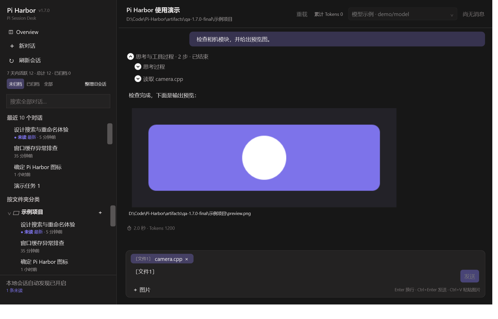
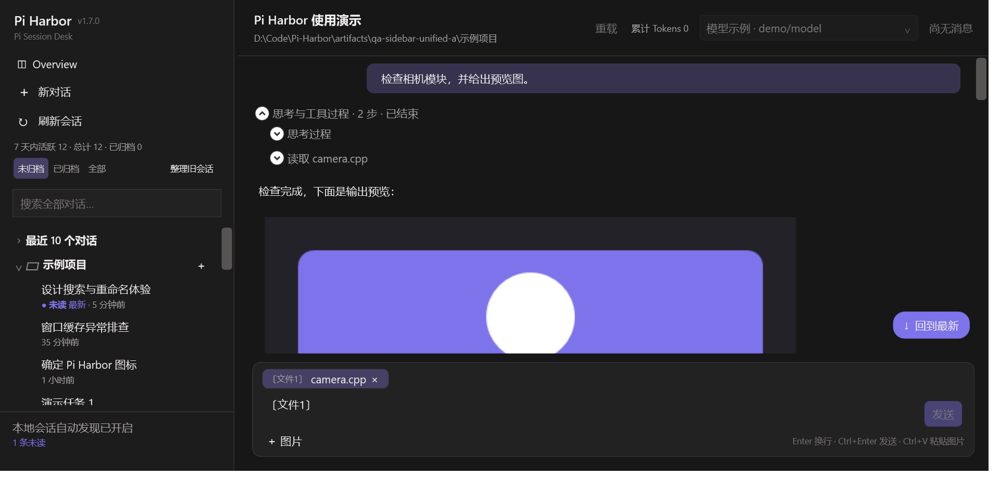
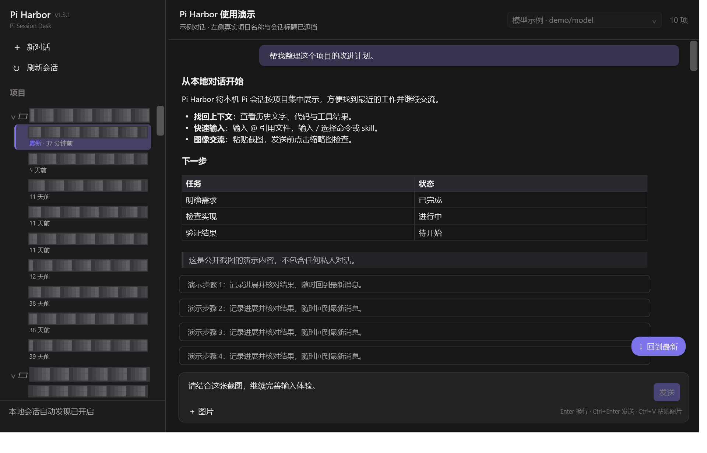
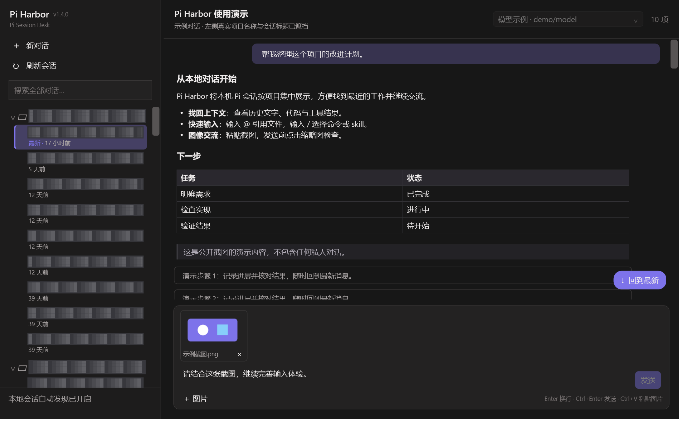
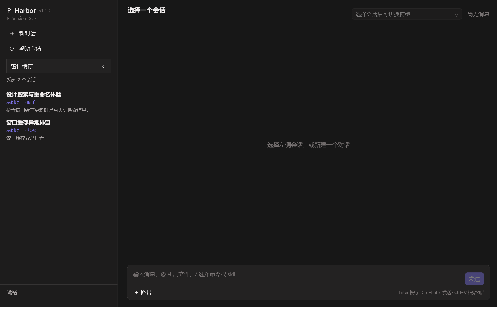
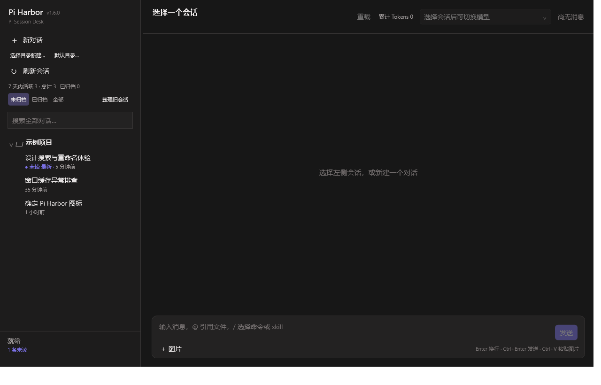

# Pi Harbor

**Pi Session Desk — 本地 Pi 会话的 Windows 桌面工作台。**

[](https://github.com/BlazarLin/Pi-Harbor/actions/workflows/ci.yml)
[](LICENSE)

按项目浏览本机 Pi 会话，找回最近的交流，继续文字与图片对话。无需启动本地 Web 服务。

**源码版本：1.7.0 · 已验证 Pi：0.85.1 · Windows 10/11 x64**

### 1.7.0 更新（2026-09-29）

**当前源码补充（2026-09-30，尚未发布）：** 最近 10 个对话已改成可折叠分组，与下面的文件夹共用一条滚动条，移除“按文件夹分类”标题及固定分区高度。点击分组标题即可收起／展开，自动刷新和归档筛选保留本次运行内的折叠选择。

左侧新增「最近 10 个对话」，位于文件夹分类之前，跨文件夹按最后交流时间倒序排列。悬停显示距上次对话的时间差、完整时间与项目目录，每分钟刷新；跟随未归档／已归档／全部筛选，支持原有右键操作。这个限制仅作用于快捷区，文件夹分类和全局搜索仍覆盖全部本机会话。

本版本同时发布此前完成的以下改进。仍然自动检索本机 Pi 会话并按真实目录分组，终端创建的会话同样进入列表、搜索和统计。

| 改进 | 使用方式 |
| --- | --- |
| 1. 文件夹快捷新建 | 点击左侧项目右侧的「＋」，直接在该目录开始独立会话 |
| 2. 新建二级菜单 | 点击「新对话」再选择默认目录、临时选择目录或设置默认目录 |
| 3. 更多文件候选 | `@` 或 `/file 关键词`，最多 120 项，CPP/H 等源码与文本优先 |
| 4. 紧凑文件标签 | 输入框使用「〔文件1〕」与可移除标签，悬停查看完整路径；发送时还原原始引用文字 |
| 5. 整轮过程折叠 | 每个问题的思考和工具步骤统一分组，完成后自动收起；手动展开的组保持展开 |
| 6. 有名称的完成通知 | 显示自定义／已保存名称，新会话以首条问题生成名称 |
| 7. 输出图片预览 | Markdown 图片或图片文件链接可预览、点击放大；本地图片自动加载，远程图片点击后联网加载 |
| 8. 每日 Token 方格 | Overview 展示今日、最近 28 天用量、活跃天数和每日方格 |
| 9. 最近会话入口 | Overview 提供最近 8 个本机会话，包含终端创建与归档会话 |
| 10. 关闭闪白修复 | 先隐藏窗口，再等待后台进程清理 |

对比依据、实现范围与逐项复验见 [产品体验优化与复验记录](docs/260924产品体验优化与复验.md)。

## 软件截图

最近 10 个对话以可折叠分组置顶，与文件夹使用同一条滚动条（当前源码、独立演示数据）：



收起最近对话后，文件夹直接上移，小窗口也能利用整个侧栏：



以下为实际 WPF 应用截图。真实项目名称与会话标题在截图前使用不透明马赛克遮挡，右侧是演示内容；活动时间、布局和交互样式保持真实。





全局搜索示例（仅使用独立测试会话）：



Overview 与输出预览（全部使用独立生成的演示会话，不含真实项目数据）：


## 下载与安装

从 [GitHub Releases](https://github.com/BlazarLin/Pi-Harbor/releases) 下载安装包或便携版；也可按下文从源码构建。

| 文件 | 使用方式 |
| --- | --- |
| `Pi-Harbor-Setup-win-x64.exe` | 当前用户安装、开始菜单入口、可选桌面快捷方式，支持升级和卸载 |
| `Pi-Harbor-win-x64.zip` | 便携版，解压后运行 `Pi-Harbor.exe` |
| `SHA256SUMS.txt` | 对照 `Get-FileHash 文件名 -Algorithm SHA256` 验证下载 |

两种包均携带 .NET 运行库。GitHub 的 **Source code (zip)** 是源码包，不是可执行版。当前安装器未签名，Windows 可能显示发布者未知提示。

## 先准备 Pi

Pi Harbor 依赖用户安装的 [Pi coding agent](https://github.com/earendil-works/pi/tree/main/packages/coding-agent)，不捆绑 Pi、Node.js 或模型认证信息。

兼容性验证基线为 **`@earendil-works/pi-coding-agent` 0.85.1**，不保证所有旧版本或未来版本都兼容。先准备符合 Pi 要求的 Node.js，再安装基线版本：

```powershell
npm install -g @earendil-works/pi-coding-agent@0.85.1
pi --version
pi
```

在 Pi 中配置模型与认证，确认终端可以交流，再运行 Pi Harbor。应用不直接读取或保存 API Key；Pi 子进程会使用自己的配置和认证。

## 功能

- 自动发现默认目录 `%USERPROFILE%\.pi\agent\sessions` 中的会话，按真实项目 `cwd` 分组。
- 按最近活动排序，显示分钟／小时／天的时间差，标记全局最新会话；每分钟刷新，悬停显示完整日期时间。
- 全局搜索会话名称、项目路径和全部已保存的消息文字，显示匹配来源及正文片段。
- 自定义重命名、跨重启保留名称、恢复默认；列表、当前标题及搜索结果同步更新。
- 加载已有对话、新建项目对话、在空闲时切换 Pi 已配置的模型。
- 流式显示文字、折叠思考与工具结果，显示每轮耗时与 Token 用量。
- 可选择复制的 Markdown 正文，支持代码块、表格、列表、引用等格式。
- `@` 引用文件，`/` 选择 Pi 命令、模板或 skill。
- 粘贴图片、添加图片文件、检查缩略图、点击放大、移除附件和纯图片消息。
- 大会话轻量历史读取与虚拟化显示；上滚保持阅读位置，紫色圆角“回到最新”恢复跟随。
- 本次运行内按会话保留草稿；发送未确认时保留输入，重新连接并核对历史后再发送。



## 操作速查

| 操作 | 方法 |
| --- | --- |
| 新对话 | 点击“新对话”打开二级菜单；也可点击文件夹右侧「＋」直接在该目录新建 |
| 默认目录 | 初始为 `%USERPROFILE%\Pi Harbor\Workspace`，在“新对话”菜单中设置默认目录 |
| 归档／恢复 | 右键会话 → 归档会话；切换“已归档”后右键恢复；“整理旧会话”可批量归档 |
| 未读标记 | 右键会话 → 标为未读／已读；打开会话查看后清除，状态跨重启保存 |
| 重载配置 | 空闲时点击标题栏“重载”或输入 `/reload`，刷新当前会话的模型、提示词和 skills |
| 继续会话 | 点击左侧会话 |
| 全局搜索 | 左侧搜索框或 `Ctrl+Shift+F`，输入关键词；`Enter` 立即搜索，`Esc` 清空 |
| 重命名 | 右键会话 → 重命名，或在会话列表中按 `F2`；支持恢复默认 |
| 发送／换行 | `Ctrl+Enter` 发送，`Enter` 换行 |
| 引用文件 | 输入 `@关键词` 或 `/file 关键词`，选择后以短标签显示，发送时还原带引号的相对路径供模型读取 |
| 命令与 skill | 在消息开头输入 `/` 筛选当前 Pi 返回的项目 |
| 选择补全 | `↑` / `↓`，`Tab` / `Enter` 确认，`Esc` 关闭 |
| 图片 | `Ctrl+V` 粘贴截图或复制的图片文件，或点击“＋ 图片” |
| 预览／移除 | 点击缩略图放大，`Esc` 关闭；点击 `×` 移除 |
| 输出预览 | 助手输出 Markdown 图片或图片文件链接后显示预览；远程图片需点击加载 |
| 整轮折叠 | 点击“思考与工具过程”展开／收起所有步骤，最终回复始终保留 |
| 用量首页 | 点击左侧 Overview；悬停每日方格查看日期、Token 和助手回复数 |
| 停止生成 | 点击“停止” |
| 打开项目目录 | 右键项目名称 → 在文件资源管理器中打开 |

不同会话使用独立 Pi 进程，可以并行处理。窗口在后台或查看其他会话时，完成／进程退出会触发 Windows 系统通知、侧栏未读和任务栏角标；点击通知可打开对应会话。Windows 勿扰模式或禁用通知可能隐藏横幅，侧栏状态仍保留。

### 会话管理与重载

Overview 读取默认会话目录中全部已发现 JSONL 的助手用量记录，按本地日期显示最近 28 天，包含终端创建、归档及历史分支的已保存用量。使用文件元数据缓存，刷新会话或点击“刷新用量”后更新。归档不扣减统计；外部删除文件后会扣减。Token 包含缓存用量，数据不是服务商账单；没有用量字段的回复不能补算，无法读取的文件和异常记录数量会在首页提示。

“7 天内活跃”按最近 7×24 小时的最后活动时间统计，“总计”统计全部有效会话，两者均包含归档。默认列表隐藏归档，可切换“未归档／已归档／全部”；全局搜索始终包含归档。批量整理会先显示数量并确认，排除当前、未读、重点关注和处理中会话。归档只改变本机显示，不删除 JSONL、不释放磁盘空间，也不会自动清理旧会话。

归档、未读及默认目录保存到 `%LOCALAPPDATA%\Pi Harbor\session-management.json`。Pi RPC 没有终端内置的 `/reload` 接口，因此 Harbor 通过重启当前会话的 Pi 进程加载配置；保留已保存上下文、输入草稿和附件，不重启其他会话。运行中的扩展内存状态会重新初始化，任务处理中不可重载。

### 搜索与自定义名称

搜索按不区分大小写的连续文字匹配，覆盖所有已保存的历史分支，以及用户、助手、思考和工具输出的文本。图片 Base64、协议字段和工具调用参数不参与搜索。最多显示最近的 100 个匹配会话，超过时提示缩小关键词；损坏记录或无法读取的文件也会提示。点击结果打开会话当前分支并定位首个已加载的匹配消息；命中思考／工具时展开对应组，其他历史分支中的命中可能不在当前视图中。

自定义名称只用于本机 Pi Harbor，保存在 `%LOCALAPPDATA%\Pi Harbor\session-names`，不会同步为 Pi 终端名称。最长 120 个字符，可恢复默认。名称按原会话文件的绝对路径关联；移动或更换会话文件路径后需重新设置。重命名不改变对话的最近交流时间。

### 终端新建的 Pi 对话

应用监听默认会话目录，文件事件合并到约 300 ms 后刷新；约 **5 秒一次的元数据复查** 补偿漏事件、根目录稍后创建和监听中断。未变化的文件使用索引缓存，刷新保留项目折叠与当前会话状态。

**Pi 0.85.1 的空会话通常尚未落盘；首条助手消息保存后才可被发现。** `pi --no-session` 不保存会话，自定义 `--session-dir` 也不在默认扫描范围。发现会话不等于实时镜像外部终端正在生成的正文；避免两个客户端同时写同一会话文件。

## 当前边界

- 草稿关闭应用后不会恢复；持久化草稿属于下一阶段。
- 本次发送的图片可以预览；重新打开历史时显示附件提示，暂不加载历史原图。
- 助手输出中的本地 PNG/JPEG/BMP/GIF/TIFF 文件链接支持预览，每条输出最多 8 张、每张 10 MB／4000 万像素，预览最长边 1200 像素；不渲染 SVG，不自动读取网络共享或远程图片。
- 每条最多 4 张图片，单张转 PNG 后不超过 10 MB、4000 万像素；GIF/TIFF 使用第一帧。图片理解能力由模型决定。
- 文件搜索跳过 `.git`、依赖和常见构建目录、符号链接；最多 120 个结果、30000 个条目或 1.5 秒，尚不完整解析 `.gitignore`。其他文件可手动输入路径。文件标签只压缩界面展示，发送引用路径，不自动将整份文件正文塞入提示词。
- `/settings` 等 Pi 终端专用命令不进入菜单；依赖交互表单的扩展尚未完整适配。
- 支持可恢复归档；尚无应用内永久删除、导出和分支树编辑。

## 从源码构建

需要 Windows x64 和 .NET 10 SDK。应用使用 Microsoft.Toolkit.Uwp.Notifications 发送系统通知；自包含发布需恢复官方运行库包。自动测试使用伪 RPC，不需要 Pi 或模型密钥。

```powershell
git clone https://github.com/BlazarLin/Pi-Harbor.git
cd Pi-Harbor
dotnet build Pi-Harbor.sln -c Debug
powershell -NoProfile -File scripts/run-tests.ps1
powershell -NoProfile -File scripts/build-release.ps1
```

输出位于 `artifacts/Pi-Harbor-win-x64/` 和 `artifacts/Pi-Harbor-win-x64.zip`。

安装 [Inno Setup 6](https://jrsoftware.org/isdl.php) 后，同时生成安装 EXE：

```powershell
powershell -NoProfile -File scripts/build-release.ps1 -IncludeInstaller
```

### GitHub Release 配置

已提供 Windows CI 和版本标签发布工作流。推送与项目版本一致的标签（当前源码为 `v1.7.0`）后，自动测试、打包并创建带 **安装 EXE、便携 ZIP、SHA256SUMS** 的 Release 草稿；维护者检查后点击 Publish release，用户即可下载。

详细设置、标签命令、手动构建、权限与签名说明见 [GitHub 发布指南](docs/GITHUB_RELEASE.md)。

## 界面验收与截图

```powershell
# 离线 Pi 输入区验收，不保存会话、不发送模型请求
artifacts\Pi-Harbor-win-x64\Pi-Harbor.exe --qa-composer-capture-dir artifacts\qa\composer

# 可公开截图：真实列表渲染前遮挡，仅用演示正文，不启动 Pi
artifacts\Pi-Harbor-win-x64\Pi-Harbor.exe --capture-public-docs artifacts\qa\public

# 搜索、Overview、文件引用、图片及整轮折叠 UI 验收：使用新目录，不启动 Pi
artifacts\Pi-Harbor-win-x64\Pi-Harbor.exe --qa-search-capture-dir artifacts\qa\search

# 大会话滚动验收
artifacts\Pi-Harbor-win-x64\Pi-Harbor.exe --capture-session <session.jsonl> --qa-scroll-capture-dir artifacts\qa\scroll
```

原始 QA 默认保存在 Git 忽略的 `artifacts/`。公开前检查实际图像，不要上传未经脱敏的会话截图。

## 架构与排查

- `PIHarness.Core`：JSONL 解析、会话目录与 Pi RPC 子进程。
- `PIHarness.App`：WPF、聊天状态、Markdown、输入与滚动交互。
- `PIHarness.Tests`：无第三方测试框架的验收程序。

应用启动 `pi --mode rpc --approve`，通过 stdin/stdout UTF-8 JSONL 通信，不启动本地网络服务。

| 问题 | 排查 |
| --- | --- |
| 未找到 pi.cmd | 确认终端 `pi --version` 成功，npm 全局目录在 `PATH` 中 |
| 终端会话未出现 | 确认 JSONL 已写入默认目录，等约 5 秒或点击刷新；空会话和其他目录不在发现范围 |
| 会话打不开 | 确认项目 `cwd` 存在；错误后用“重新连接”恢复草稿与上下文 |
| 模型／认证／限额错误 | 在 Pi 中修复配置后点击“重载”，核对历史后再发送 |
| 没有完成弹窗 | 检查 Windows 通知权限及勿扰模式；侧栏紫色未读和任务栏角标可兜底 |
| 图片失败 | 确认模型支持图像，缩小图片或减少附件 |

## 贡献、许可与路线图

欢迎 [报告问题](https://github.com/BlazarLin/Pi-Harbor/issues) 或提交 PR。参阅 [贡献指南](CONTRIBUTING.md)、[安全报告](SECURITY.md)、[更新记录](CHANGELOG.md)。

后续优先完善跨重启草稿、历史图片按需预览、模型能力提示和扩展交互表单，再推进会话导出及安装包代码签名。实现记录见 [输入体验与产品完善](docs/260907输入体验与产品完善记录.md)、[开源发布准备与验收](docs/260907开源发布准备记录.md)、[搜索重命名与图标](docs/260908搜索重命名与图标.md)。

代码使用 [MIT License](LICENSE)，运行库与安装器遵循 [第三方许可](THIRD-PARTY-NOTICES.md)。Pi Harbor 是独立社区项目，不代表 Pi、Microsoft 或 OpenAI 官方。
