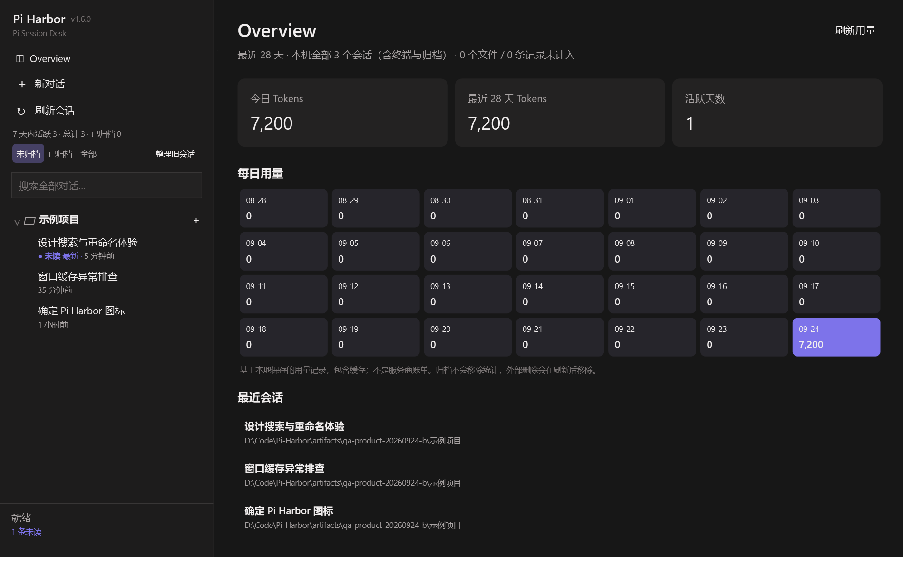
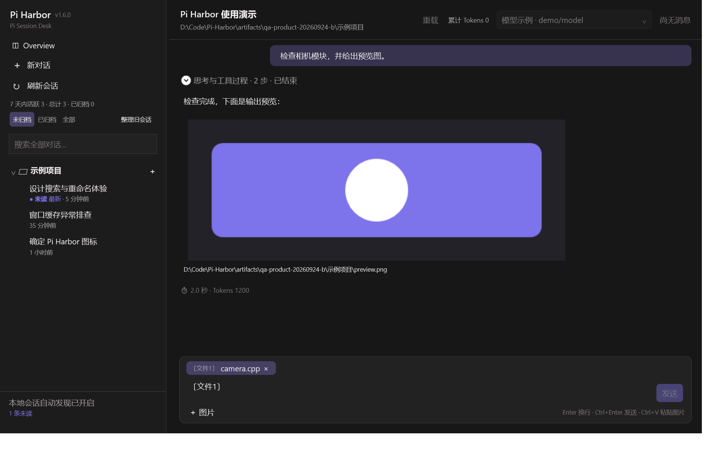

# Pi Harbor 产品体验优化与复验

日期：2026-09-24。源码保持 1.6.0，本轮不创建版本标签或 GitHub Release。

## 对比与取舍

用户提供的两个链接对应不同项目：

- [pi-desktop.com](https://pi-desktop.com/) 链接到 [FaqFirebase/pi-desktop](https://github.com/FaqFirebase/pi-desktop)。可以借鉴每日用量面板、文件引用、折叠工具过程和图像预览，使常用信息更容易找到。
- [vastsa/PI-Desktop](https://github.com/vastsa/PI-Desktop) 更强调项目工作区、面板与插件。可以借鉴项目上下文入口和逐层呈现操作，减少主界面的常驻按钮。

本轮借鉴交互思路，没有复制对方源码。Pi Harbor 继续以本机 Pi JSONL 为会话来源；按真实 cwd 分组，文件监听与约 5 秒元数据复查保持启用。不能将“在 Harbor 内新建”作为会话进入索引的条件。

## 十项改进及复验

| # | 改进与验收条件 | 复验结果 |
| --- | --- | --- |
| 1 | 文件夹行增加「＋」，使用该目录创建独立会话，不复用未保存的新对话 | UI 验证按钮目录；TEST-41B 验证同目录两次新建与草稿隔离 |
| 2 | 新对话使用二级菜单，主界面不再常驻选择目录／默认目录按钮 | UI 验证主界面及三项菜单 |
| 3 | 文件候选最多 120 项，提高列表高度，CPP/H 等源码文本优先，支持 /file 查询 | TEST-31B、41A；UI 验证 32 个候选与列表高度 |
| 4 | 输入框短占位符与可移除文件标签，发送还原原始带引号路径 | TEST-41B 检查伪 RPC 实际收到的 prompt；UI 对照短标签与原文 |
| 5 | 单个问题的思考和工具步骤组成可折叠组，结果保持可见，完成后收起，手动展开不被覆盖 | TEST-41C；UI 验证完成折叠及手动展开 |
| 6 | Windows 通知带对话名称，新会话首条问题生成名称，重载不破坏生成逻辑 | TEST-41D；实际 Windows 通知历史中存在演示标题 |
| 7 | 输出 Markdown 图片／图片文件链接显示缩略图并可放大，相对路径基于当前项目 | TEST-41F 路径与协议；UI 验证真实 BitmapSource 缩略图并检查截图 |
| 8 | Overview 的 28 天 Token 方格、今日／累计值和活跃天数来自全部本机会话 | TEST-41E 验证终端文件、归档、追加、去重、异常记录和取消；UI 验证方格 |
| 9 | Overview 增加最近 8 个会话快捷入口；看首页不等于看过后台结果 | UI 验证外部写入的最近会话；TEST-41D 验证首页未读状态 |
| 10 | 关闭窗口先隐藏深色界面，再释放后台进程，避免清理阶段闪白 | UI 走真实关闭流程，记录 Hidden before shutdown: True，进程正常退出 |

## 验证记录

- Release 构建成功，零警告、零错误。
- 完整自定义回归套件：79 / 79 通过，不需要模型凭据。
- 独立演示数据 UI 验收：23 / 23 通过，覆盖搜索、重命名、归档与本轮新增界面。
- Windows 系统通知：Enabled；通知历史存在记录，记录内容包含对话名称。测试通知随后清除。
- 输出截图已人工查看，只含人工生成的示例项目、标题和图像，没有真实项目列表。
- 关闭验收确认先隐藏后清理并正常退出；该检查不等同于所有显卡驱动环境的逐帧录像验证。

可重现命令（UI 输出目录必须尚不存在）：

```powershell
powershell -NoProfile -File scripts/run-tests.ps1
src/PIHarness.App/bin/Release/net10.0-windows10.0.17763.0/Pi-Harbor.exe --qa-search-capture-dir artifacts/qa-product-new
src/PIHarness.App/bin/Release/net10.0-windows10.0.17763.0/Pi-Harbor.exe --qa-notification-report artifacts/qa-notification-new.txt
git diff --check
```

## 数据口径与边界

- Token 使用助手记录中的 totalTokens，缺失时合计 input、output、cacheRead、cacheWrite。按本地日期统计，包含缓存与已保存分支，不是服务商账单。归档不改变统计，外部删除会话会在刷新后移除用量。
- 会话扫描仍使用默认 Pi 会话根目录；未落盘的终端空会话、no-session 和其他 session-dir 不会凭空出现在索引中。
- 文件选择保留原有路径引用语义，短标签只用于展示，不自动读取整份文件正文。
- 图片支持本地 PNG/JPEG/BMP/GIF/TIFF，单条最多 8 张、10 MB／4000 万像素，预览最长边 1200 像素。远程 HTTP(S) 图片显式点击加载；不自动访问网络共享，不支持 SVG 和历史内嵌图片还原。
- 首页统计采用文件元数据缓存，较大历史库首次扫描可能较慢，扫描在后台执行。




